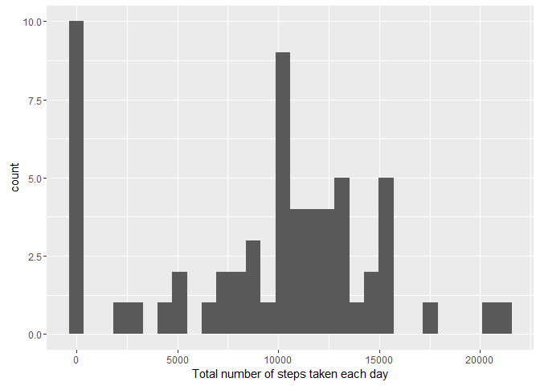

# Peer-graded Assignment 1
Maria Arce  
24 de diciembre de 2016  


## What is mean total number of steps taken per day?

1. Calculate the total number of steps taken per day

```r
actByday<-activity%>%group_by(date)%>%summarise(Steps=sum(steps,na.rm=T));datatable(actByday)
```

<!--html_preserve--><div id="htmlwidget-81aeff2524b58d62286a" style="width:100%;height:auto;" class="datatables html-widget"></div>
<script type="application/json" data-for="htmlwidget-81aeff2524b58d62286a">{"x":{"filter":"none","data":[["1","2","3","4","5","6","7","8","9","10","11","12","13","14","15","16","17","18","19","20","21","22","23","24","25","26","27","28","29","30","31","32","33","34","35","36","37","38","39","40","41","42","43","44","45","46","47","48","49","50","51","52","53","54","55","56","57","58","59","60","61"],["2012-10-01","2012-10-02","2012-10-03","2012-10-04","2012-10-05","2012-10-06","2012-10-07","2012-10-08","2012-10-09","2012-10-10","2012-10-11","2012-10-12","2012-10-13","2012-10-14","2012-10-15","2012-10-16","2012-10-17","2012-10-18","2012-10-19","2012-10-20","2012-10-21","2012-10-22","2012-10-23","2012-10-24","2012-10-25","2012-10-26","2012-10-27","2012-10-28","2012-10-29","2012-10-30","2012-10-31","2012-11-01","2012-11-02","2012-11-03","2012-11-04","2012-11-05","2012-11-06","2012-11-07","2012-11-08","2012-11-09","2012-11-10","2012-11-11","2012-11-12","2012-11-13","2012-11-14","2012-11-15","2012-11-16","2012-11-17","2012-11-18","2012-11-19","2012-11-20","2012-11-21","2012-11-22","2012-11-23","2012-11-24","2012-11-25","2012-11-26","2012-11-27","2012-11-28","2012-11-29","2012-11-30"],[0,126,11352,12116,13294,15420,11015,0,12811,9900,10304,17382,12426,15098,10139,15084,13452,10056,11829,10395,8821,13460,8918,8355,2492,6778,10119,11458,5018,9819,15414,0,10600,10571,0,10439,8334,12883,3219,0,0,12608,10765,7336,0,41,5441,14339,15110,8841,4472,12787,20427,21194,14478,11834,11162,13646,10183,7047,0]],"container":"<table class=\"display\">\n  <thead>\n    <tr>\n      <th> \u003c/th>\n      <th>date\u003c/th>\n      <th>Steps\u003c/th>\n    \u003c/tr>\n  \u003c/thead>\n\u003c/table>","options":{"columnDefs":[{"className":"dt-right","targets":2},{"orderable":false,"targets":0}],"order":[],"autoWidth":false,"orderClasses":false}},"evals":[],"jsHooks":[]}</script><!--/html_preserve-->

2. If you do not understand the difference between a histogram and a barplot, research the difference between them. Make a histogram of the total number of steps taken each day


```r
ggplot(actByday,aes(x=Steps))+geom_histogram()+xlab("Total number of steps taken each day")
```

<!-- -->

3. Calculate and report the mean and median of the total number of steps taken per day


```r
mean<-actByday%>%summarise(Mean_Steps=mean(Steps,na.rm=T),Median_Steps=median(Steps,na.rm=T));mean
```

```
## # A tibble: 1 × 2
##   Mean_Steps Median_Steps
##        <dbl>        <int>
## 1    9354.23        10395
```

The mean of the total number of stepstaken per day is 9354.2295082 and the median is 10395.

## What is the average daily activity pattern?

1. Make a time series plot (i.e. type = "l") of the 5-minute interval (x-axis) and the average number of steps taken, averaged across all days (y-axis)


```r
actByint<-activity%>%group_by(interval)%>%summarise(Mean_Steps=mean(steps,na.rm=T))%>%arrange(desc(Mean_Steps))

ggplot(actByint,aes(x=interval,y=Mean_Steps))+geom_line()+xlab("5-minute interval")+ylab("Mean number of steps taken")+geom_vline(xintercept = actByint$interval[1],col="red",linetype="dashed")
```

<!-- -->

2. Which 5-minute interval, on average across all the days in the dataset, contains the maximum number of steps?


```r
datatable(actByint)
```

<!--html_preserve--><div id="htmlwidget-be6b3b653ab6bb699280" style="width:100%;height:auto;" class="datatables html-widget"></div>
<script type="application/json" data-for="htmlwidget-be6b3b653ab6bb699280">{"x":{"filter":"none","data":[["1","2","3","4","5","6","7","8","9","10","11","12","13","14","15","16","17","18","19","20","21","22","23","24","25","26","27","28","29","30","31","32","33","34","35","36","37","38","39","40","41","42","43","44","45","46","47","48","49","50","51","52","53","54","55","56","57","58","59","60","61","62","63","64","65","66","67","68","69","70","71","72","73","74","75","76","77","78","79","80","81","82","83","84","85","86","87","88","89","90","91","92","93","94","95","96","97","98","99","100","101","102","103","104","105","106","107","108","109","110","111","112","113","114","115","116","117","118","119","120","121","122","123","124","125","126","127","128","129","130","131","132","133","134","135","136","137","138","139","140","141","142","143","144","145","146","147","148","149","150","151","152","153","154","155","156","157","158","159","160","161","162","163","164","165","166","167","168","169","170","171","172","173","174","175","176","177","178","179","180","181","182","183","184","185","186","187","188","189","190","191","192","193","194","195","196","197","198","199","200","201","202","203","204","205","206","207","208","209","210","211","212","213","214","215","216","217","218","219","220","221","222","223","224","225","226","227","228","229","230","231","232","233","234","235","236","237","238","239","240","241","242","243","244","245","246","247","248","249","250","251","252","253","254","255","256","257","258","259","260","261","262","263","264","265","266","267","268","269","270","271","272","273","274","275","276","277","278","279","280","281","282","283","284","285","286","287","288"],[835,840,850,845,830,820,855,815,825,900,810,905,910,915,920,1550,1845,1545,925,1210,1215,1205,1850,1855,1840,1815,1900,1555,1540,1725,1905,1830,1740,1810,1610,1835,800,1720,745,1730,805,1825,1255,930,1535,1605,1200,615,1220,1615,1600,1715,1355,1625,1735,1820,1155,1910,1805,750,1620,1745,1325,1705,755,1400,730,715,1230,610,1345,1915,1015,740,630,1405,725,1025,1710,710,1225,1135,620,720,605,655,1415,1530,1525,1350,625,1700,1320,1650,1150,1520,1950,1645,935,1250,1640,1145,555,705,735,1030,645,640,1630,700,1455,1655,1450,1410,1310,1330,1010,1300,1140,1430,1315,1800,1000,1935,1340,1305,550,635,1020,1515,945,1635,1245,1425,1755,1035,650,1920,1505,1510,1420,950,1750,1040,1955,1130,2015,1235,2050,1055,600,1100,1940,1500,1105,1120,1045,1435,1930,2030,1005,2020,1240,1125,1445,1115,1945,1335,1050,940,2110,2035,1110,2045,2025,955,1925,2055,2000,2040,2010,2115,2005,545,2105,1440,2135,540,2100,2130,2120,2230,2225,2140,2215,2150,2125,2145,2220,535,2210,2335,2255,430,2205,440,520,2300,2340,450,510,525,2305,2155,2330,410,515,2235,25,530,130,0,330,2250,2325,505,250,45,2200,400,210,125,455,2355,2320,255,405,35,445,2315,105,435,2345,325,335,30,340,145,425,5,115,420,100,2240,50,150,235,2350,320,135,140,15,110,10,55,225,2245,20,345,40,120,155,200,205,215,220,230,240,245,300,305,310,315,350,355,415,500,2310],[206.169811320755,195.924528301887,183.396226415094,179.566037735849,177.301886792453,171.150943396226,167.018867924528,157.528301886792,155.396226415094,143.452830188679,129.433962264151,124.037735849057,109.11320754717,108.11320754717,103.716981132075,102.11320754717,99.4528301886792,98.6603773584906,95.9622641509434,94.8490566037736,92.7735849056604,87.6981132075472,86.5849056603774,85.6037735849057,85.3396226415094,85.3207547169811,84.8679245283019,83.9622641509434,82.9056603773585,78.9433962264151,77.8301886792453,77.6981132075472,75.0943396226415,74.6981132075472,74.5471698113208,74.2452830188679,73.377358490566,72.7169811320755,69.5471698113208,68.9433962264151,68.2075471698113,67.7735849056604,67.2830188679245,66.2075471698113,65.3207547169811,64.1320754716981,63.8679245283019,63.4528301886792,63.3962264150943,63.1698113207547,62.1320754716981,61.2264150943396,60.811320754717,59.7735849056604,59.6603773584906,59.2641509433962,59.188679245283,58.0377358490566,58.0188679245283,57.8490566037736,56.9056603773585,56.5094339622642,56.4339622641509,56.3018867924528,56.1509433962264,55.7547169811321,55.6792452830189,54.5094339622642,54.4716981132075,53.7735849056604,53.5471698113208,53.3584905660377,52.6603773584906,52.2641509433962,52.1509433962264,51.9622641509434,50.9811320754717,50.7924528301887,50.7169811320755,50.5094339622642,50.1698113207547,49.9811320754717,49.9622641509434,49.9245283018868,49.2641509433962,49.0377358490566,48.6981132075472,48.1320754716981,47.7547169811321,47.3207547169811,47.0754716981132,46.622641509434,46.2452830188679,46.2075471698113,46.0377358490566,45.9622641509434,45.6603773584906,45.4528301886792,45.2264150943396,45.0566037735849,44.6603773584906,44.6037735849057,44.4905660377358,44.377358490566,44.3207547169811,44.2830188679245,44.1698113207547,44.0188679245283,43.8679245283019,43.811320754717,43.7735849056604,43.6792452830189,43.622641509434,43.5849056603774,43.2641509433962,42.7547169811321,42.4150943396226,42.3396226415094,42.0377358490566,41.8490566037736,40.9811320754717,40.6792452830189,40.5660377358491,40.0188679245283,39.9622641509434,39.8867924528302,39.4528301886792,39.3396226415094,38.9245283018868,38.8490566037736,38.7547169811321,38.5660377358491,37.7358490566038,37.5471698113208,37.4528301886792,37.4150943396226,37.3584905660377,36.3207547169811,36.0754716981132,35.4905660377358,35.4716981132075,34.9811320754717,34.7735849056604,34.6981132075472,33.5283018867925,33.4339622641509,33.3396226415094,32.4150943396226,32.3018867924528,31.9433962264151,31.4905660377358,31.3584905660377,30.2075471698113,30.0188679245283,29.6792452830189,28.377358490566,28.3396226415094,27.5094339622642,27.3962264150943,27.3018867924528,26.9811320754717,26.811320754717,26.5283018867925,26.4716981132075,26.0754716981132,25.5471698113208,25.5471698113208,25.1320754716981,25.0943396226415,24.7924528301887,23.4528301886792,21.3396226415094,21.3207547169811,21.3207547169811,21.1698113207547,21.0566037735849,20.7169811320755,20.1509433962264,19.622641509434,19.5471698113208,19.3396226415094,19.2452830188679,19.0188679245283,18.3396226415094,17.2264150943396,17.1132075471698,16.3018867924528,16.0188679245283,15.9433962264151,14.6603773584906,12.4528301886792,9.75471698113208,8.69811320754717,8.67924528301887,8.50943396226415,8.13207547169811,8.0188679245283,7.79245283018868,7.07547169811321,6.05660377358491,4.81132075471698,4.69811320754717,4.60377358490566,4.11320754716981,3.67924528301887,3.49056603773585,3.32075471698113,3.30188679245283,3.30188679245283,3.11320754716981,3,2.9622641509434,2.84905660377358,2.62264150943396,2.60377358490566,2.56603773584906,2.24528301886792,2.20754716981132,2.09433962264151,2.09433962264151,1.83018867924528,1.71698113207547,1.62264150943396,1.60377358490566,1.58490566037736,1.56603773584906,1.54716981132075,1.47169811320755,1.45283018867925,1.18867924528302,1.13207547169811,1.11320754716981,1.11320754716981,1.07547169811321,0.962264150943396,0.943396226415094,0.943396226415094,0.867924528301887,0.830188679245283,0.830188679245283,0.679245283018868,0.660377358490566,0.641509433962264,0.622641509433962,0.584905660377358,0.528301886792453,0.490566037735849,0.377358490566038,0.358490566037736,0.339622641509434,0.339622641509434,0.339622641509434,0.320754716981132,0.320754716981132,0.30188679245283,0.264150943396226,0.226415094339623,0.226415094339623,0.207547169811321,0.169811320754717,0.169811320754717,0.150943396226415,0.150943396226415,0.132075471698113,0.132075471698113,0.132075471698113,0.113207547169811,0.0754716981132075,0.0754716981132075,0,0,0,0,0,0,0,0,0,0,0,0,0,0,0,0,0,0,0]],"container":"<table class=\"display\">\n  <thead>\n    <tr>\n      <th> \u003c/th>\n      <th>interval\u003c/th>\n      <th>Mean_Steps\u003c/th>\n    \u003c/tr>\n  \u003c/thead>\n\u003c/table>","options":{"columnDefs":[{"className":"dt-right","targets":[1,2]},{"orderable":false,"targets":0}],"order":[],"autoWidth":false,"orderClasses":false}},"evals":[],"jsHooks":[]}</script><!--/html_preserve-->

The 5-minute interval that contains the maximum number of steps is 835.

## Imputing missing values

1. Calculate and report the total number of missing values in the dataset (i.e. the total number of rows with NAs)


```r
miss<-sum(is.na(activity$steps));miss
```

```
## [1] 2304
```

The total number of missing values in the dataset is 2304

2. Devise a strategy for filling in all of the missing values in the dataset. The strategy does not need to be sophisticated. For example, you could use the mean/median for that day, or the mean for that 5-minute interval, etc.
3. Create a new dataset that is equal to the original dataset but with the missing data filled in.


```r
activity2<-activity
intervals<-unique(activity2$interval)
for(i in 1:length(intervals)){
  activity2$steps[activity2$interval==intervals[i] & is.na(activity2$steps)]<-
    mean(activity2$steps[activity2$interval==intervals[i]],na.rm=T)
}
```

4. Make a histogram of the total number of steps taken each day and Calculate and report the mean and median total number of steps taken per day. Do these values differ from the estimates from the first part of the assignment? What is the impact of imputing missing data on the estimates of the total daily number of steps?


```r
actByday2<-activity2%>%group_by(date)%>%summarise(Steps=sum(steps,na.rm=T));datatable(actByday2)
```

<!--html_preserve--><div id="htmlwidget-a4d04f6a22fc23eca13a" style="width:100%;height:auto;" class="datatables html-widget"></div>
<script type="application/json" data-for="htmlwidget-a4d04f6a22fc23eca13a">{"x":{"filter":"none","data":[["1","2","3","4","5","6","7","8","9","10","11","12","13","14","15","16","17","18","19","20","21","22","23","24","25","26","27","28","29","30","31","32","33","34","35","36","37","38","39","40","41","42","43","44","45","46","47","48","49","50","51","52","53","54","55","56","57","58","59","60","61"],["2012-10-01","2012-10-02","2012-10-03","2012-10-04","2012-10-05","2012-10-06","2012-10-07","2012-10-08","2012-10-09","2012-10-10","2012-10-11","2012-10-12","2012-10-13","2012-10-14","2012-10-15","2012-10-16","2012-10-17","2012-10-18","2012-10-19","2012-10-20","2012-10-21","2012-10-22","2012-10-23","2012-10-24","2012-10-25","2012-10-26","2012-10-27","2012-10-28","2012-10-29","2012-10-30","2012-10-31","2012-11-01","2012-11-02","2012-11-03","2012-11-04","2012-11-05","2012-11-06","2012-11-07","2012-11-08","2012-11-09","2012-11-10","2012-11-11","2012-11-12","2012-11-13","2012-11-14","2012-11-15","2012-11-16","2012-11-17","2012-11-18","2012-11-19","2012-11-20","2012-11-21","2012-11-22","2012-11-23","2012-11-24","2012-11-25","2012-11-26","2012-11-27","2012-11-28","2012-11-29","2012-11-30"],[10766.1886792453,126,11352,12116,13294,15420,11015,10766.1886792453,12811,9900,10304,17382,12426,15098,10139,15084,13452,10056,11829,10395,8821,13460,8918,8355,2492,6778,10119,11458,5018,9819,15414,10766.1886792453,10600,10571,10766.1886792453,10439,8334,12883,3219,10766.1886792453,10766.1886792453,12608,10765,7336,10766.1886792453,41,5441,14339,15110,8841,4472,12787,20427,21194,14478,11834,11162,13646,10183,7047,10766.1886792453]],"container":"<table class=\"display\">\n  <thead>\n    <tr>\n      <th> \u003c/th>\n      <th>date\u003c/th>\n      <th>Steps\u003c/th>\n    \u003c/tr>\n  \u003c/thead>\n\u003c/table>","options":{"columnDefs":[{"className":"dt-right","targets":2},{"orderable":false,"targets":0}],"order":[],"autoWidth":false,"orderClasses":false}},"evals":[],"jsHooks":[]}</script><!--/html_preserve-->

```r
ggplot(actByday2,aes(x=Steps))+geom_histogram()+xlab("Total number of steps taken each day")
```

<!-- -->

```r
mean2<-actByday2%>%summarise(Mean_Steps=mean(Steps,na.rm=T),Median_Steps=median(Steps,na.rm=T));mean2
```

```
## # A tibble: 1 × 2
##   Mean_Steps Median_Steps
##        <dbl>        <dbl>
## 1   10766.19     10766.19
```

Total steps by date differ from the values in the first part of the assignment. Days that had a total of 0 steps now are equal to the mean and median values of the total data.


## Are there differences in activity patterns between weekdays and weekends?

1. Create a new factor variable in the dataset with two levels – “weekday” and “weekend” indicating whether a given date is a weekday or weekend day.


```r
Sys.setlocale("LC_TIME", "English")
```

```
## [1] "English_United States.1252"
```

```r
activity2$day<-weekdays(as.Date(activity2$date))
activity2$day_fact<-"weekday"
activity2$day_fact[activity2$day=="Saturday" | activity2$day=="Sunday"]<-"weekend"
activity2$day_fact<-factor(activity2$day_fact)
```

2. Make a panel plot containing a time series plot (i.e. type = "l") of the 5-minute interval (x-axis) and the average number of steps taken, averaged across all weekday days or weekend days (y-axis). See the README file in the GitHub repository to see an example of what this plot should look like using simulated data.


```r
actByDayWInt<-activity2%>%group_by(day_fact,interval)%>%summarise(Steps=mean(steps,na.rm=T));actByDayWInt
```

```
## Source: local data frame [576 x 3]
## Groups: day_fact [?]
## 
##    day_fact interval      Steps
##      <fctr>    <int>      <dbl>
## 1   weekday        0 2.25115304
## 2   weekday        5 0.44528302
## 3   weekday       10 0.17316562
## 4   weekday       15 0.19790356
## 5   weekday       20 0.09895178
## 6   weekday       25 1.59035639
## 7   weekday       30 0.69266247
## 8   weekday       35 1.13794549
## 9   weekday       40 0.00000000
## 10  weekday       45 1.79622642
## # ... with 566 more rows
```

```r
ggplot(actByDayWInt,aes(x=interval,y=Steps))+geom_line()+facet_grid(day_fact~.)+ylab("Number of Steps")
```

<!-- -->

